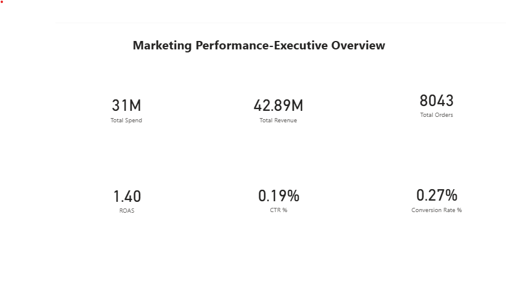
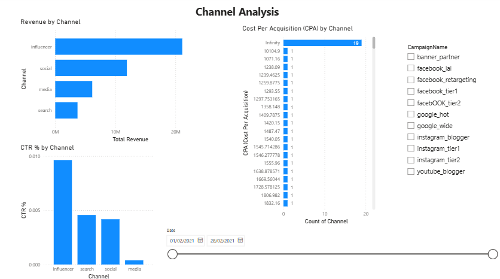
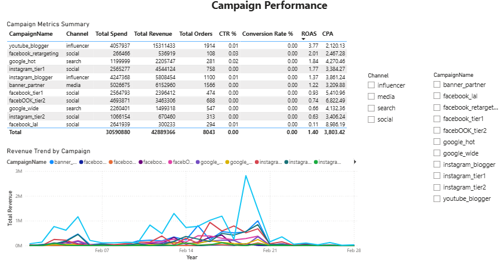

# 📊 Marketing Performance Dashboard (Power BI)

This project analyzes multi-channel marketing campaign data to measure spend efficiency, ROI, channel performance, and campaign effectiveness.  
It demonstrates my skills in **Power BI, DAX, data modeling, Power Query, and business analytics**.

---

## 🔍 **Objective**

Marketing teams often ask:
- Which channels deliver the best ROI?
- Which campaigns generate the most revenue?
- Where are we overspending (high CPA)?
- Which channels drive the strongest engagement (CTR)?
- How is performance trending over time?

This dashboard answers these questions through clear, interactive visuals.

---

## 🛠️ **Tools Used**

- **Power BI Desktop**  
- **Power Query** (data cleaning & transformation)  
- **DAX** (KPIs & measures)  
- **Excel** (source dataset)  

---

## 📁 **Dataset Overview**

The dataset includes:
- Date  
- Campaign Name  
- Channel  
- Spend  
- Impressions  
- Clicks  
- Leads  
- Orders  
- Revenue  

Derived metrics calculated:
- **CTR (Click-Through Rate)**  
- **CPC (Cost Per Click)**  
- **CPL (Cost Per Lead)**  
- **CPA (Cost Per Acquisition)**  
- **ROAS (Return on Ad Spend)**  

---

## ⚙️ **Data Preparation (Power Query)**

Steps performed:
- Renamed and standardized column names  
- Corrected data types (Date, Numeric, Text)  
- Created calculated KPI columns  
- Cleaned formatting for Spend, Revenue, CPA  
- Loaded final dataset into Power BI model  

---

## 📐 **DAX Measures Created**

- **Total Spend**  
- **Total Revenue**  
- **Total Clicks**  
- **Total Orders**  
- **CTR %**  
- **Conversion Rate %**  
- **CPA**  
- **ROAS**  

These measures power all visual KPIs in the dashboard.

---

## 📊 **Dashboard Pages**

### **🟦 Page 1 — Executive Overview**
- Total Spend  
- Total Revenue  
- Total Orders  
- CTR %  
- Conversion Rate %  
- ROAS  
- Revenue Trend Line  

---

### **🟩 Page 2 — Channel Analysis**
- Revenue by Channel  
- CPA by Channel  
- CTR % by Channel  
- Date slicer (Between range)  
- Campaign slicer  

---

### **🟧 Page 3 — Campaign Performance**
- Campaign-level KPI comparison table  
- Revenue Trend by Campaign  
- Channel & Campaign slicers  

---

## 📸 **Dashboard Screenshots**

### 📊 Executive Overview  


### 📈 Channel Analysis  


### 📉 Campaign Performance  


---

## 📦 **Repository Structure**

```text
marketing-performance-powerbi/
│
├── data/
│   └── Marketing.csv
│
├── reports/
│   ├── executive_overview.png
│   ├── channel_analysis.png
│   └── campaign_performance.png
│
├── pbix/
│   └── marketing_performance_dashboard.pbix
│
└── README.md
